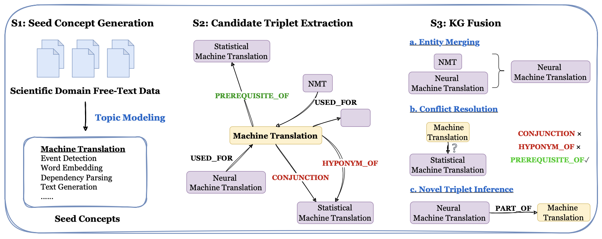

# Graphusion 

Graphusion is a pipeline that extract Knowledge Graph triples from text.




## CITATION

- I have deep respect for the [creators of this repo](https://anonymous.4open.science/r/CGPrompt-C9C7/readme.md) and authors of the related [AGENTiGraph](https://arxiv.org/abs/2410.11531) paper.
- The DiscoverAI YouTube channel also had an interesting video highlighting the various use cases and diverse backgrounds of the authors of the paper:  https://www.youtube.com/watch?v=tB5s7Q-8DsE

```txt
@misc{zhao2024agentigraphinteractiveknowledgegraph,
      title={AGENTiGraph: An Interactive Knowledge Graph Platform for LLM-based Chatbots Utilizing Private Data}, 
      author={Xinjie Zhao and Moritz Blum and Rui Yang and Boming Yang and Luis Márquez Carpintero and Mónica Pina-Navarro and Tony Wang and Xin Li and Huitao Li and Yanran Fu and Rongrong Wang and Juntao Zhang and Irene Li},
      year={2024},
      eprint={2410.11531},
      archivePrefix={arXiv},
      primaryClass={cs.AI},
      url={https://arxiv.org/abs/2410.11531}, 
}
```

## Setup
Create a new conda environment and install the required packages:
```
conda create -n graphusion python=3.10
conda activate graphusion
pip install -r requirements.txt
```

## Input Data Structure

1. **Text Data**: Place raw text files in `data/[dataset_name]/raw/`
2. **Relation Definitions**: JSON file defining relationship types and descriptions
3. **Optional Expert Data**:
   - Gold concepts (TSV): Expert-provided concept definitions
   - Refined concepts (TSV): Curated concept list
   - Annotated graph: Existing knowledge graph structure

## Output Files

The pipeline generates three main outputs:

1. `concept_abstracts.json`: Mapping between concepts and their source abstracts
2. `step-02.jsonl`: Extracted knowledge graph triples
3. `step-03.jsonl`: Final fused and refined knowledge graph

## Configuration Options

| Parameter | Description | Type | Required |
|-----------|-------------|------|----------|
| run_name | Unique identifier for the run | string | No |
| dataset | Input dataset name | string | Yes |
| relation_definitions_file | Path to relations JSON | string | Yes |
| model | LLM model name | string | No |
| max_resp_tok | Maximum response tokens | int | No |
| max_input_char | Maximum input characters | int | No |
| language | Content language | string | No |
| verbose | Enable detailed logging | bool | No |

## Usage
The pipeline processes text files from the `data/[dataset_name]/raw` directory (e.g., `data/test/raw`) as input. 
Furthermore, the pipeline requires relation definitions as a JSON file. This file defines the relations and 
provides a description of the relation (e.g., `data/test/relation_types.json`). In addition, some information can be 
provided to improve the results (`--gold_concept_file`, `--refined_concepts_file`, `--annotated_graph_file`)
or to skip pipeline steps (`--input_json_file`, `--input_triple_file`). See parameters below.

The ACL data is originally in a csv format. Therefore, we provide the notebook `preprocess.ipynb` to convert the 
data into the required text files.

The pipeline can be run using the following command:

```
usage: main.py [-h] [--run_name RUN_NAME] --dataset DATASET --relation_definitions_file RELATION_DEFINITIONS_FILE [--input_json_file INPUT_JSON_FILE]
               [--input_triple_file INPUT_TRIPLE_FILE] [--model MODEL] [--max_resp_tok MAX_RESP_TOK] [--max_input_char MAX_INPUT_CHAR]
               [--prompt_tpextraction PROMPT_TPEXTRACTION] [--prompt_fusion PROMPT_FUSION] [--gold_concept_file GOLD_CONCEPT_FILE]
               [--refined_concepts_file REFINED_CONCEPTS_FILE] [--annotated_graph_file ANNOTATED_GRAPH_FILE] [--language LANGUAGE] [--verbose]

options:
  -h, --help            show this help message and exit
  --run_name RUN_NAME   Assign a name to this run. The name will be used to, e.g., determine the output directory. We recommend to use unique and descriptive names to
                        distinguish the results of different models.
  --dataset DATASET     Name of the dataset. Is used to, e.g., determine the input directory.
  --relation_definitions_file RELATION_DEFINITIONS_FILE
                        Path to the relation definitions file. The file should be a JSON file, where the keys are the relation types and the values are dictionaries with the
                        following keys: 'label', 'description'.
  --input_json_file INPUT_JSON_FILE
                        Path to the input file. Step 1 will be skipped if this argument is provided. The input file should be a JSON file with the following structure:
                        {'concept1': [{'abstract': ['abstract1', ...], 'label: 0},...} E.g. data/test/concept_abstracts.json is the associated file createddurin step 1 in the
                        test run.
  --input_triple_file INPUT_TRIPLE_FILE
                        Path to the input file storing the triples in the format as outputted by the candidate triple extraction model. Step 1 and step 2 will be skipped if
                        this argument is provided.
  --model MODEL         Name of the LLM that should be used for the KG construction.
  --max_resp_tok MAX_RESP_TOK
                        Maximum number of tokens in the response of the candidate triple extraction model.
  --max_input_char MAX_INPUT_CHAR
                        Maximum number of characters in the input of the candidate triple extraction model.
  --prompt_tpextraction PROMPT_TPEXTRACTION
                        Path to the prompt template for step 1.
  --prompt_fusion PROMPT_FUSION
                        Path to the prompt template for fusion.
  --gold_concept_file GOLD_CONCEPT_FILE
                        Path to a file with concepts that are provided by experts. The file should be a tsv file, each row should look like: 'concept id | concept
  --refined_concepts_file REFINED_CONCEPTS_FILE
                        In step 2 (candidate triple extraction) many new concepts might be added. Instead of using these, concepts can be provided through this parameter.
                        Specify the path to a file with refined concepts of the graph. The file should be a tsv file, each row should look like: "concept id | concept name"
  --annotated_graph_file ANNOTATED_GRAPH_FILE
                        Path to the annotated graph.
  --language LANGUAGE   Language of the abstracts.
  --verbose             Print additional information to the console.
```

The output of the pipeline are the following files: 
- `concept_abstracts`: The json file mapping the extracted concepts to their abstracts.
- `step-02.jsonl`: The extracted triples in linewise JSON format.
- `step-03.jsonl`: The fused triples in linewise JSON format.


## Example 
To run the full pipeline on a small sample (`test`) dataset, call: 
`python main.py --run_name "test" --dataset "test" --relation_definitions_file "data/test/relation_types.json" --gold_concept_file "data/test/gold_concepts.tsv" --refined_concepts_file "data/test/refined_concepts.tsv"`

To reproduce the Graphusion results on the ACL (`nlp) dataset, call:
`python main.py --run_name "acl" --dataset "nlp" --relation_definitions_file "data/nlp/relation_types.json" --gold_concept_file "data/nlp/gold_concepts.tsv" --refined_concepts_file "data/nlp/refined_concepts.tsv"`

---

## AGENTiGraph Framework Overview**

---

### Introduction
**AGENTiGraph** is a novel multi-agent framework that bridges Large Language Models (LLMs) and Knowledge Graphs (KGs), aiming to overcome limitations in AI models for complex, domain-specific tasks. The platform allows multiple agents, each leveraging LLMs, to interpret user queries, extract concepts, plan tasks, interact with the KG, reason, generate responses, and dynamically add new knowledge.

The framework includes **seven specialized agents** designed to manage specific tasks, which enhances consistency, reasoning, and adaptability when handling complex queries.

**Paper Title**: *AGENTiGraph: An Interactive Knowledge Graph Platform for LLM-based Chatbots Utilizing Private Data*  
**Authors**: Researchers from eight institutions, including University of Tokyo, Duke Medical School, and Yale University  
**Publication Date**: October 15, 2024  
**Link**: [arxiv.org/pdf/2410.11531](https://arxiv.org/pdf/2410.11531)

---

### Key Components of AGENTiGraph

1. **Multi-Agent System**: Integrates multiple LLM-powered agents with a KG to perform complex tasks in a structured, decomposed manner.
2. **Semantic Mapping**: Uses BERT-derived embeddings to map extracted entities and relations from user queries onto the KG, aligning similar terms for accurate information retrieval.
3. **Task Decomposition**: Queries are broken down into manageable tasks, allowing agents to interact with the KG and perform reasoning in a stepwise fashion.
4. **Agent Functions**:
   - **User Intent Interpretation**: Classifies the user’s query type (e.g., relationship judgment, prerequisite prediction).
   - **Key Concept Extraction**: Extracts entities and relations from the query.
   - **Task Planning**: Decomposes the query into logical, executable tasks.
   - **Knowledge Graph Interaction**: Uses Cypher or SPARQL queries to retrieve information from the KG.
   - **Reasoning**: Analyzes retrieved data to synthesize relevant information.
   - **Response Generation**: Crafts user responses.
   - **Dynamic Knowledge Integration**: Updates the KG with newly discovered relationships.

---

### Example Use Case: Exploring Quantum Entanglement

**Query**: "What foundational concepts should I learn to understand the relationship between quantum entanglement and teleportation?"

1. **User Intent Interpretation Agent**: Identifies the query as a request for prerequisite knowledge.
2. **Key Concept Extraction Agent**: Extracts "quantum entanglement" and "teleportation" as key concepts.
3. **Task Planning Agent**: Plans tasks to map out foundational concepts.
4. **Knowledge Graph Interaction Agent**: Executes SPARQL or Cypher queries to retrieve relevant nodes and relations.
5. **Reasoning Agent**: Synthesizes information from the KG, identifying foundational topics.
6. **Response Generation Agent**: Formulates a structured response.
7. **Dynamic Knowledge Integration Agent**: Updates the KG if any new relevant relationships are found.

---

### AGENTiGraph's Technical Methodology

1. **Semantic Mapping**: Uses BERT embeddings to match user query entities with KG nodes even when terminology differs.
2. **Knowledge Graph Querying**: Executes structured queries to retrieve knowledge, although the framework currently relies on greedy query processing rather than advanced methods like beam search.
3. **Performance Metrics**: AGENTiGraph demonstrates 95% accuracy in task classification and a 90% success rate in task execution.

---

### Insights on Agent-Specific Prompts

Each agent in AGENTiGraph is configured with a tailored prompt to optimize task performance:
- **Example Prompt (User Intent Interpretation)**: "You are an expert NLP task classifier specializing in knowledge graph interactions. Analyze the given query and classify it into categories like relationship judgment or prerequisite prediction."
- **Example Prompt (Key Concept Extraction)**: "Identify and extract key concepts and relations, mapping them to the KG schema using BERT-derived embeddings."

---

### Potential for Further Optimization

While AGENTiGraph's current setup performs well, further enhancements are possible:
- **Beam Search**: Could enable exploring multiple reasoning paths simultaneously.
- **Custom BERT Models**: Domain-specific BERT systems can improve semantic accuracy, especially in specialized fields.

---

### Conclusion

AGENTiGraph represents a significant advancement in AI research, showcasing how multi-agent systems and knowledge graphs can be combined with LLMs for improved factual consistency, reasoning, and adaptability. The platform opens new possibilities for complex, structured information retrieval and reasoning in domain-specific AI applications.

---

## AGENTiGraph & Graphusion Implementation Guide

### Overview

This repository contains the Graphusion pipeline described in the AGENTiGraph paper's appendix D.2. While the paper describes a full system with a dual-mode interface, this implementation focuses on the knowledge graph construction pipeline.

### Repository Contents

1. Knowledge Graph Construction Pipeline:
   - Step 1: Concept extraction (step_01_concept_extraction.py)
   - Step 2: Triple extraction (step_02_triple_extraction.py)
   - Step 3: Knowledge fusion (step_03_fusion.py)

2. Key Input Files:
   - Relation definitions: data/test/relation_types.json
   - Gold concepts: data/test/gold_concepts.tsv
   - Refined concepts: data/test/refined_concepts.tsv

### Setup Instructions

1. Create and activate Python virtual environment:
```bash
python -m venv .venv
source .venv/bin/activate  # On Windows use `.venv\Scripts\activate`
```

2. Install requirements:
```bash
pip install -r requirements.txt
```

3. Set OpenAI API key:
```bash
export OPENAI_API_KEY="your-key-here"
```

### Running the Pipeline

1. Basic pipeline execution:
```bash
python main.py --run_name "test" --dataset "test" \
    --relation_definitions_file "data/test/relation_types.json" \
    --gold_concept_file "data/test/gold_concepts.tsv" \
    --refined_concepts_file "data/test/refined_concepts.tsv"
```

2. Pipeline outputs (in output/[run_name]/):
   - concept_abstracts.json: Concept to abstract mappings
   - concepts.tsv: Extracted concepts
   - step-02.jsonl: Initial triple extractions
   - step-03.jsonl: Refined/fused triples

### Neo4j Integration

The step-03.jsonl file contains triples that can be loaded into Neo4j to create the knowledge graph. The paper describes using this graph with a dual-mode interface (chatbot and exploration views), but that interface implementation is not included in this repository.

### Understanding the Pipeline

1. Concept Extraction (Step 1):
   - Uses BERTopic for concept discovery
   - Integrates with predefined gold concepts
   - Outputs concepts and their associated abstracts

2. Triple Extraction (Step 2):
   - Uses LLM to extract relationships between concepts
   - Follows predefined relation types from relation_definitions.json
   - Generates candidate triples

3. Knowledge Fusion (Step 3):
   - Refines and integrates triples
   - Produces final knowledge graph structure
   - Outputs step-03.jsonl for Neo4j import

### Relationship to AGENTiGraph Paper

While the paper describes a complete system with:
- 7 specialized agents
- Dual-mode user interface
- Chat and exploration capabilities

This repository implements the underlying knowledge graph construction pipeline (Graphusion) that would support such a system. The UI and agent implementations are not included.

### Available Test Files

The repository includes Jupyter notebooks for testing different components:
- test_fusion.ipynb: Tests knowledge fusion
- test_graph.ipynb: Tests graph operations
- test_topic_extraction.ipynb: Tests concept extraction
- test_tpextraction.ipynb: Tests triple extraction

These can be useful for understanding and debugging the pipeline components.

### Next Steps

If you want to build the full AGENTiGraph system:
1. Use this pipeline to construct your knowledge graph
2. Implement the 7 agents described in the paper
3. Build the dual-mode interface following the paper's specifications
4. Connect everything using the Neo4j database as the central knowledge store
